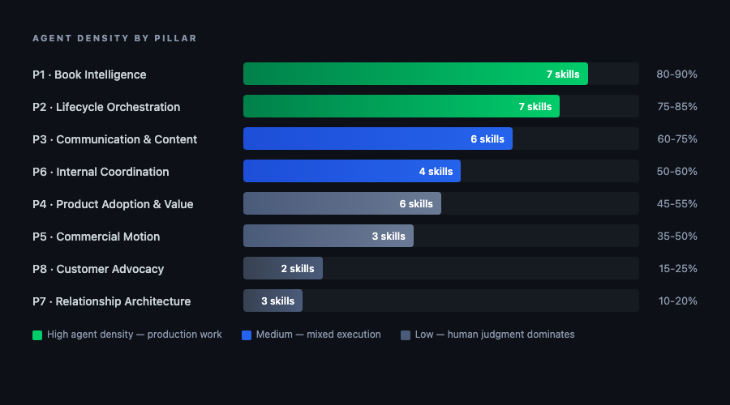
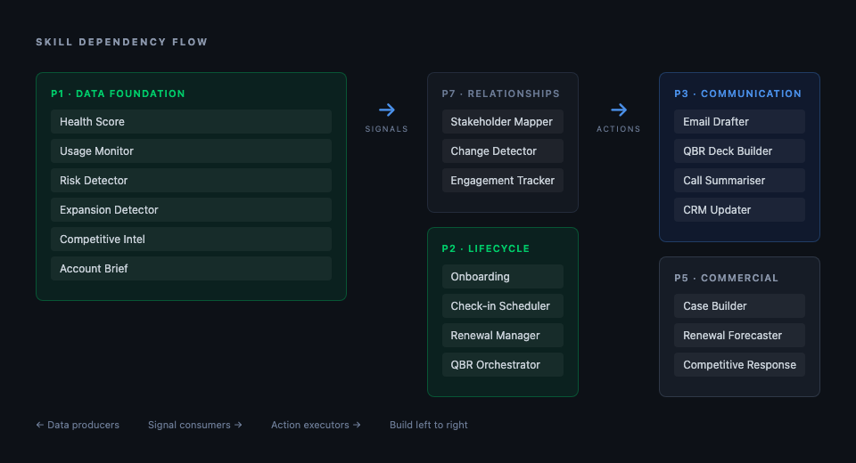

# The Augmented CSM

**38 agent skills that cover the complete CSM operational surface area. Built to the [Agent Skills](https://agentskills.io) open standard.**

CSMs spend 60-70% of their week on work that does not require their judgment -- data gathering, report formatting, email drafting, CRM maintenance, meeting preparation, follow-up communications, status tracking. This repo contains the skill specifications to hand that work to agents so CSMs can focus on the 20-40% that actually drives outcomes: strategic diagnosis, relationship judgment, commercial timing, and the human craft of customer success.

## What This Is

A complete decomposition of the CSM role into eight operational pillars, with every agent-executable activity specified as a skill following the [agentskills.io](https://agentskills.io) open standard. Each skill includes trigger conditions, execution logic, output formats, human decision guides, and dependency maps.

This is not a product. It is a specification -- an architecture document that maps what agents should do, what humans should do, and where the boundary sits.

## Who This Is For

This architecture is designed for **B2B SaaS companies with named-account CS motions** -- typically 50-500 managed customers with dedicated or pooled CSMs. If your motion is high-touch enterprise, mid-market relationship-driven, or managed SMB, this maps directly.

If you run a pure PLG motion with 10,000+ self-serve accounts, a consumption-based model, or a fully digital-touch scaled programme, the pillar structure still applies but the skill decomposition would look different. The principles transfer; the specifications need adaptation.

The agent density estimates (60-70% blended) are derived from operational analysis of mid-market B2B SaaS CS teams. They should be validated through your own process audit before implementation.

### Start Here

If you want to start using agent skills immediately without system integration, see **[CSM Skills](https://github.com/stephenrogan/csm-skills)** -- 58 plug-and-play skills that work from a single conversation. Use them standalone today; wire them into your data systems when you are ready for the full architecture.

## Agent Density by Pillar



> The gradient tells you where human CS value lives. The top of the stack is production work — reliable, repeatable, agent-executable. The bottom is judgment, relationships, and strategy — the craft that drives outcomes.

## The Eight Pillars

| # | Pillar | Skills | Agent Density | What It Covers |
|---|--------|--------|--------------|----------------|
| 1 | **Book Intelligence** | 7 | 80-90% | Health scoring, usage monitoring, risk detection, expansion signals, segment trends, account briefing, competitive intelligence |
| 2 | **Lifecycle Orchestration** | 7 | 75-85% | Onboarding, check-in scheduling, renewal management, QBR orchestration, milestone tracking, handoffs, SLA monitoring |
| 3 | **Communication & Content** | 6 | 60-75% | Email drafting, QBR deck building, call summarisation, internal briefs, CRM updates, report generation |
| 4 | **Product Adoption & Value** | 6 | 45-55% | Feature adoption tracking, peer benchmarking, value/ROI reporting, feedback aggregation, enablement coordination, knowledge base curation |
| 5 | **Commercial Motion** | 3 | 35-50% | Expansion case building, renewal forecasting, competitive response preparation |
| 6 | **Internal Coordination** | 4 | 50-60% | Escalation routing, internal notifications, feature request tracking, cross-functional meeting prep |
| 7 | **Relationship Architecture** | 3 | 10-20% | Stakeholder mapping, change detection, engagement tracking |
| 8 | **Customer Advocacy & Community** | 2 | 15-25% | Advocacy programme management, community monitoring |

**Total: 38 skills across 8 pillars.**

## The Governing Principle

Any process step where a human executes work that does not require human judgment is a candidate for agent execution. The goal is not to replace CSMs but to multiply their impact -- absorbing growth without proportional headcount increases.

The agent handles production work. The human handles judgment, relationships, and strategy. The boundary between the two is defined explicitly in every skill specification.

## Repo Structure

```
augmented-csm/
├── README.md
├── LICENSE
├── CONTRIBUTING.md
├── docs/
│   ├── architecture.md          # The eight-pillar framework
│   ├── build-sequence.md        # Recommended implementation order
│   ├── data-prerequisites.md    # Required integrations and data quality
│   └── human-decision-points.md # Where and why humans remain in the loop
└── skills/
    ├── pillar-1-book-intelligence/
    │   ├── bi-health-score/
    │   │   ├── SKILL.md
    │   │   ├── scripts/
    │   │   └── references/
    │   ├── bi-usage-monitor/
    │   ├── bi-risk-detector/
    │   ├── bi-expansion-detector/
    │   ├── bi-segment-trends/
    │   ├── bi-account-brief/
    │   └── bi-competitive-intel/
    ├── pillar-2-lifecycle-orchestration/
    │   ├── lo-onboarding-orchestrator/
    │   ├── lo-check-in-scheduler/
    │   ├── lo-renewal-manager/
    │   ├── lo-qbr-orchestrator/
    │   ├── lo-milestone-tracker/
    │   ├── lo-handoff-manager/
    │   └── lo-sla-monitor/
    ├── pillar-3-communication-content/
    │   ├── cc-email-drafter/
    │   ├── cc-qbr-deck-builder/
    │   ├── cc-call-summariser/
    │   ├── cc-internal-brief-writer/
    │   ├── cc-crm-updater/
    │   └── cc-report-generator/
    ├── pillar-4-product-adoption/
    │   ├── pa-adoption-tracker/
    │   ├── pa-benchmark-engine/
    │   ├── pa-value-reporter/
    │   ├── pa-feedback-aggregator/
    │   ├── pa-enablement-orchestrator/
    │   └── pa-knowledge-base-curator/
    ├── pillar-5-commercial-motion/
    │   ├── cm-commercial-case-builder/
    │   ├── cm-renewal-forecaster/
    │   └── cm-competitive-response-prep/
    ├── pillar-6-internal-coordination/
    │   ├── ic-escalation-router/
    │   ├── ic-internal-notifier/
    │   ├── ic-feature-request-tracker/
    │   └── ic-cross-func-prep/
    ├── pillar-7-relationship-architecture/
    │   ├── ra-stakeholder-mapper/
    │   ├── ra-stakeholder-change-detector/
    │   └── ra-engagement-tracker/
    └── pillar-8-customer-advocacy/
        ├── ca-advocacy-tracker/
        └── ca-community-monitor/
```

## How to Use This

### As a CS Leader

Read the pillar structure and skill specifications to understand what your team's agent-augmented operating model could look like. Use the AGENT/HUMAN classifications to audit your own processes. Start with Pillar 1 (Book Intelligence) -- it is the foundation everything else depends on.

### As a CS Ops / RevOps Builder

Each skill specification is detailed enough to begin implementation. The SKILL.md files follow the [agentskills.io](https://agentskills.io) open standard and are compatible with Claude, Codex, and other skills-compatible platforms. Fork the repo, adapt the specifications to your tech stack, and build.

### As a PE Operating Partner or CFO

The eight-pillar framework is a diagnostic tool. Map your portfolio company's CS operation against it. The gap between their current state and this architecture is the efficiency opportunity. The agent density percentages tell you how much of the CSM's week can be reclaimed.

## Spec Compliance

Every skill in this repo follows the [Agent Skills specification](https://agentskills.io/specification):

- SKILL.md with YAML frontmatter (name, description under 1024 chars)
- Kebab-case naming, no XML in frontmatter
- Progressive disclosure: core instructions in SKILL.md, detailed references in `references/`
- SKILL.md files under 500 lines
- Compatible with Claude, Codex, and other skills-compatible agent platforms

## Skill Dependency Flow



> Data flows left to right: Book Intelligence and Relationship Architecture produce the signals. Lifecycle and Communication consume them. Commercial Motion acts on them. Build in this order.

## Build Sequence

If you are implementing this, do not try to build all 38 skills at once. Follow the dependency chain:

**Phase 1 (Weeks 1-4):** Pillar 1 foundation -- `bi-health-score` and `bi-usage-monitor`. These produce the data everything else consumes.

**Phase 2 (Weeks 3-6):** Pillar 1 detection + Pillar 7 data -- `bi-risk-detector`, `bi-expansion-detector`, `ra-stakeholder-mapper`, `ra-engagement-tracker`. These produce the signals and relationship data that drive the operational pillars.

**Phase 3 (Weeks 5-10):** Pillar 2 core -- `lo-onboarding-orchestrator`, `lo-check-in-scheduler`, `lo-renewal-manager`. The highest-impact lifecycle workflows.

**Phase 4 (Weeks 8-14):** Pillar 3 + remaining Pillar 1 -- `cc-email-drafter`, `cc-call-summariser`, `cc-crm-updater`, `bi-account-brief`, `bi-segment-trends`. The daily productivity layer.

**Phase 5 (Weeks 12-18):** Everything else. By this point you have the foundation, the detection layer, the core workflows, and the daily productivity tools. The remaining skills add depth and sophistication.

## What This Does Not Cover

- **Implementation code.** These are specifications, not deployments. Each skill needs to be implemented against your specific tech stack (CRM, product analytics, support platform, etc.)
- **Data infrastructure.** The skills assume access to product analytics, CRM, support data, and calendar/email integrations. See [docs/data-prerequisites.md](docs/data-prerequisites.md) for the full integration requirements
- **Change management.** Introducing agent-augmented processes to a CS team requires framing, training, and trust-building. The specs tell the system what to do; you need to tell your team why
- **Custom calibration.** Health score weights, risk signal severity, benchmark thresholds, and cadence rules all need tuning for your specific business. The defaults are sensible starting points, not production-ready configurations

## Why Open Source

CS as a discipline has no shared technical language for what agents should do. Every team reinvents the same wheels -- health scoring, risk detection, renewal workflows -- from scratch, in isolation. The result is thousands of companies building the same basic architecture independently, each making the same mistakes.

This repo exists to provide a starting point that is more complete than anything most teams would build alone, and to create a shared reference that the CS community can improve collectively. The specifications are opinionated but the MIT licence means you can fork, adapt, and disagree freely.

If this saves a CS Ops team two months of architecture work, or helps a VP of CS articulate what their agent-augmented operating model should look like, it has done its job.

## Contributing

See [CONTRIBUTING.md](CONTRIBUTING.md). PRs welcome -- particularly for new reference documents, alternative skill implementations, and real-world calibration data.

## Feedback

The core thesis: your processes were built for the wrong operator. Rebuild them for agents to execute and humans to direct, and you unlock 60-70% of your team's capacity for the work that actually drives retention.

If you implement any of this, we would genuinely like to hear about it -- what worked, what did not, and what you had to change. Open a discussion in this repo.

## Licence

[MIT](LICENSE)
